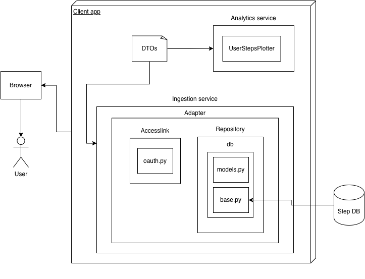

# step-ingestor

Personal project: a Python-based web application that ingests activity data from the Polar API and displays it on a simple dashboard.
My goal was to learn how to apply software design patterns, set up a testing environment, and use GitHub Actions for a continuous integration pipeline.

## Lessons learned

* How to implement an OAuth 2.0 flow for user authentication
* Adapter and Repository design patterns
* Benefits of using Data Transfer Objects
* Refactoring takes a lot of time
* Using Testcontainers for integration testing

## Python libraries used

* Python 3.13
* Flask
* Authlib
* SQLAlchemy
* Pydantic
* Plotly
* Pytest
* FastAPI
* Testcontainers

## Requirements

### Functional

* User can log in and out
* User can view step data

### Structural

* Architecture: monolith
* Security:

  * API: OAuth 2.0, HTTPS
* Testing: integration
* CI pipeline: GitHub Actions

## Architecture

## References

* [https://www.polar.com/accesslink-api/#polar-accesslink-api](https://www.polar.com/accesslink-api/#polar-accesslink-api)
* [https://refactoring.guru/design-patterns/adapter](https://refactoring.guru/design-patterns/adapter)
* [https://flask.palletsprojects.com/en/stable/web-security/](https://flask.palletsprojects.com/en/stable/web-security/)
* [https://www.cosmicpython.com/book/chapter_02_repository.html](https://www.cosmicpython.com/book/chapter_02_repository.html)